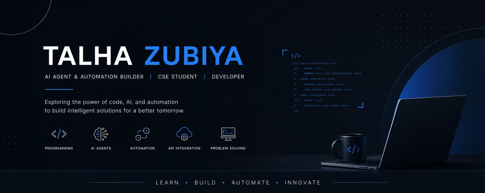

<p align="center">
  
</p>

# Hi, I'm Talha Zubiya

### AI Agent & Automation Builder | CSE Student | Developer

<p align="left">
  <a href="https://github.com/TalhaZubiya">
    
  </a>
  <a href="https://www.linkedin.com/in/talhazubiya/">
    
  </a>
  <a href="mailto:talhazubiya@gmail.com">
    
  </a>
</p>

---

## About Me

I am a Computer Science & Engineering student with a strong interest in programming, software development, AI agents, automation, and emerging technologies.

My learning journey started with programming fundamentals and gradually moved into C, C++, Data Structures, Java, and Object-Oriented Programming. From there, I started exploring AI Agents, RAG, workflow automation, APIs, and intelligent systems.

Currently, I am focusing on expanding my knowledge in AI-powered systems and automation while continuing to strengthen my core CSE foundation.

I don't want to limit myself to one particular technology or field. I want to continuously explore different areas of Computer Science, build practical solutions, and understand how technology can be applied to real-world problems.

---

## Current Focus

| Area        | What I'm Learning                           |
| ----------- | ------------------------------------------- |
| Programming | C, C++, Java, Problem Solving               |
| Core CSE    | Data Structures, OOP, Algorithms            |
| AI          | AI Agents, RAG, LLM Applications            |
| Automation  | n8n, Zapier, Workflow Automation            |
| Integration | REST APIs, Webhooks, API Integration        |
| Development | Git, GitHub, VS Code                        |
| Exploration | Advanced AI Systems & Emerging Technologies |

---

## Programming & Software Development

Programming is one of the core foundations of my CSE journey.

### Programming Languages

<p>
  
</p>

| Technology | Learning Focus                              |
| ---------- | ------------------------------------------- |
| C          | Programming Fundamentals                    |
| C++        | Programming & Problem Solving               |
| Java       | Application Development                     |
| Python     | Upcoming — AI, ML, Automation & Development |


---

## AI Agents & Automation

I am currently focusing heavily on AI Agents and Automation, but I consider this an ongoing learning journey.

There is still a lot more to explore in this field, including advanced agent architectures, multi-agent systems, RAG pipelines, tool calling, APIs, intelligent workflows, and production-oriented automation.

### Technologies & Tools

| Area             | Technologies                           |
| ---------------- | -------------------------------------- |
| AI               | LLMs, OpenAI API, AI Agents            |
| RAG              | Embeddings, Vector Databases, Pinecone |
| Agent Frameworks | LangChain, Langflow                    |
| Automation       | n8n, Zapier                            |
| Data & Workflow  | Airtable, Google Sheets, Google Forms  |
| Integration      | REST APIs, Webhooks                    |
| Development      | Git, GitHub, VS Code                   |

My goal is to move beyond basic automation and gradually build more advanced, intelligent, and scalable AI-powered systems.

---

## Learning Journey

My learning journey is continuously evolving. I started by building a strong programming foundation and gradually moved toward AI-powered systems and automation.

```text
                    MY CSE LEARNING JOURNEY

                          C
                          │
                          ▼
                         C++
                          │
                          ▼
                  Data Structures
                          │
                          ▼
                        Java
                          │
                          ▼
                         OOP
                          │
                          ▼
               AI Agents & Automation
                          │
              ┌───────────┼───────────┐
              ▼           ▼           ▼
             RAG         n8n        Zapier
              │           │           │
              └───────────┼───────────┘
                          ▼
                 Advanced AI Systems
                          │
                          ▼
                Advanced AI Projects
                          │
                          ▼
                     Next Stage
                          │
        ┌─────────────────┼─────────────────┐
        ▼                 ▼                 ▼
     Python           Databases       Microprocessors
        │                 │                 │
        └─────────────────┼─────────────────┘
                          ▼
                  Machine Learning
                          │
                          ▼
                    Cybersecurity
                          │
                          ▼
                 More CSE Technologies
                          │
                          ▼
                 Continuous Learning
```

---

## Tech Stack

### Languages

<p>
  
</p>

### Development Tools

<p>
  
</p>

### AI & Automation

| Category        | Tools                   |
| --------------- | ----------------------- |
| AI              | OpenAI API, LLMs        |
| AI Frameworks   | LangChain, Langflow     |
| Vector Database | Pinecone                |
| Automation      | n8n, Zapier             |
| Data Tools      | Airtable, Google Sheets |
| Integration     | REST APIs, Webhooks     |

---

## Future Vision

My goal is not simply to learn technologies or become proficient in a particular field. I want to explore Computer Science beyond its conventional boundaries and bring it into real life on a much larger scale. I want to discover new ways to use Computer Science to solve real-world problems, create meaningful solutions, and represent technology in new forms, new perspectives, and new possibilities.


> I don't want to simply follow where technology is going.
> I want to explore where Computer Science can go next.

My long-term vision is to take Computer Science into real life on a larger scale and represent it in new ways — creating, experimenting, and exploring possibilities that go beyond what already exists.

---

## GitHub Statistics

<p align="center">
  
  
</p>

---

## Contribution Graph

<p align="center">
  
</p>

---

## Connect With Me

<p align="left">
  <a href="https://www.linkedin.com/in/talhazubiya/">
    
  </a>
  <a href="https://github.com/TalhaZubiya">
    
  </a>
  <a href="mailto:talhazubiya@gmail.com">
    
  </a>
</p>

---

<p align="center">
  <b>Building. Learning. Exploring.</b><br>
  Always curious about what Computer Science can become.
</p>
