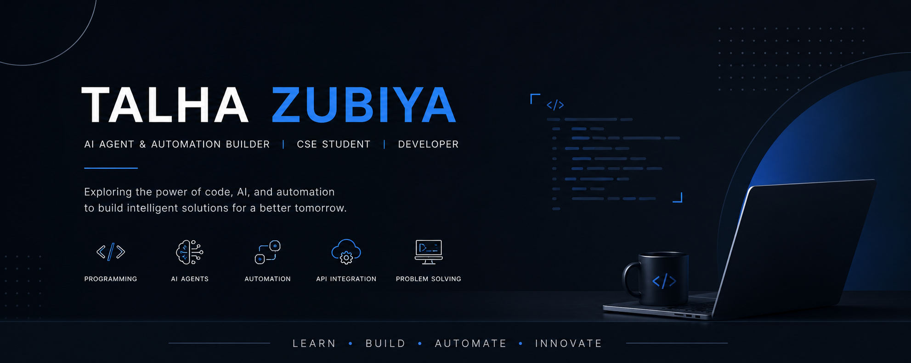
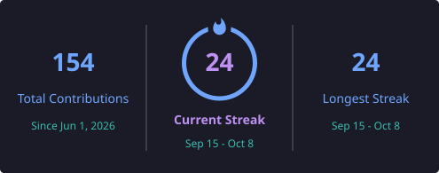

  

# Hi, I'm Talha Zubiya

### AI Agent & Automation Builder | CSE Student | Developer

  
  
  

---

## About Me

I am a Computer Science & Engineering student with a strong interest in programming, software development, AI agents, automation, and emerging technologies.

My learning journey started with programming fundamentals and gradually moved into C, C++, Data Structures, Java, and Object-Oriented Programming. From there, I started exploring AI Agents, RAG, workflow automation, APIs, and intelligent systems.

Currently, I am focusing on expanding my knowledge in AI-powered systems and automation while continuing to strengthen my core CSE foundation.

I don't want to limit myself to one particular technology or field. I want to continuously explore different areas of Computer Science, build practical solutions, and understand how technology can be applied to real-world problems.

---

## Programming & Software Development

Programming is one of the core foundations of my CSE journey.

### Programming Languages

  

| Technology | Learning Focus                              |
| ---------- | ------------------------------------------- |
| C          | Programming Fundamentals                    |
| C++        | Programming & Problem Solving               |
| Java       | Application Development                     |
| Python     | Upcoming — AI, ML, Automation & Development |

---

## AI Agents & Automation

I am currently focusing heavily on AI Agents and Automation, but I consider this an ongoing learning journey.

There is still a lot more to explore in this field, including advanced agent architectures, multi-agent systems, RAG pipelines, tool calling, APIs, intelligent workflows, and production-oriented automation.

### Technologies & Tools

| Area             | Technologies                           |
| ---------------- | -------------------------------------- |
| AI               | LLMs, OpenAI API, AI Agents            |
| RAG              | Embeddings, Vector Databases, Pinecone |
| Agent Frameworks | LangChain, Langflow                    |
| Automation       | n8n, Zapier                            |
| Data & Workflow  | Airtable, Google Sheets, Google Forms  |
| Integration      | REST APIs, Webhooks                    |
| Development      | Git, GitHub, VS Code                   |

My goal is to move beyond basic automation and gradually build more advanced, intelligent, and scalable AI-powered systems.

---

## Tech Stack

### Languages

  

### Development Tools

  

### AI & Automation

| Category        | Tools                   |
| --------------- | ----------------------- |
| AI              | OpenAI API, LLMs        |
| AI Frameworks   | LangChain, Langflow     |
| Vector Database | Pinecone                |
| Automation      | n8n, Zapier             |
| Data Tools      | Airtable, Google Sheets |
| Integration     | REST APIs, Webhooks     |

---

## GitHub Statistics

  
  
  

---

## Contribution Graph

  

---

## Connect With Me

  
  
  

---

  <b>Building. Learning. Exploring.</b> 
  Always curious about what Computer Science can become.

